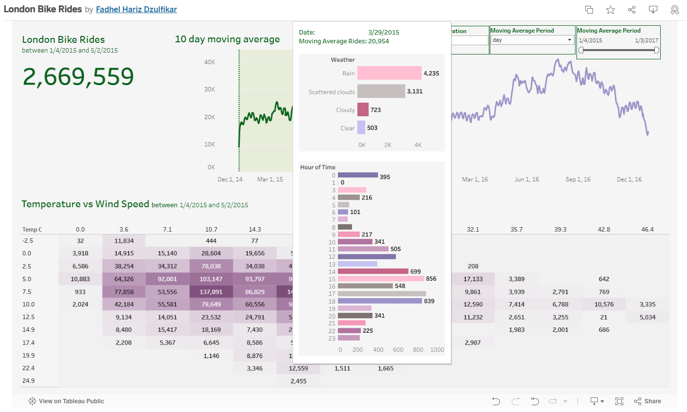

# London Bike Rides Analysis

## Project Overview

This project is an interactive Tableau dashboard that visualizes bike rides in London from January 4, 2015, to January 3, 2017. It provides insights into bike usage trends based on factors such as temperature, wind speed, weather conditions, and time of day.

The project is inspired by the YouTube tutorial: https://www.youtube.com/watch?v=nl9eZl1IOKI&ab_channel=MoChen

Special thanks to Mo Chen for the insightful tutorial that guided this project!

## Key Insights from the Dashboard

1. Weather affects bike rides significantly: Fewer rides occur on rainy days compared to clear days.

2. Peak hours: Most bike rides happen between 8 AM – 10 AM and 5 PM – 7 PM, likely due to commuting patterns.

3. Temperature impact: More rides occur in mild temperatures (~5°C to 15°C) compared to extreme cold or heat.

4. Wind speed factor: High wind speeds negatively affect the number of rides.

Link to dataset on Kaggle ➡︎ https://www.kaggle.com/datasets/hmavrodiev/london-bike-sharing-dataset

Link to the London Bike Rides Tableau dashboard ➡︎  https://public.tableau.com/shared/XDNT882WY